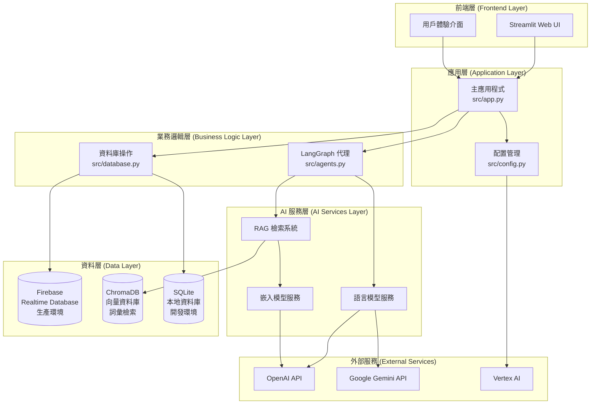
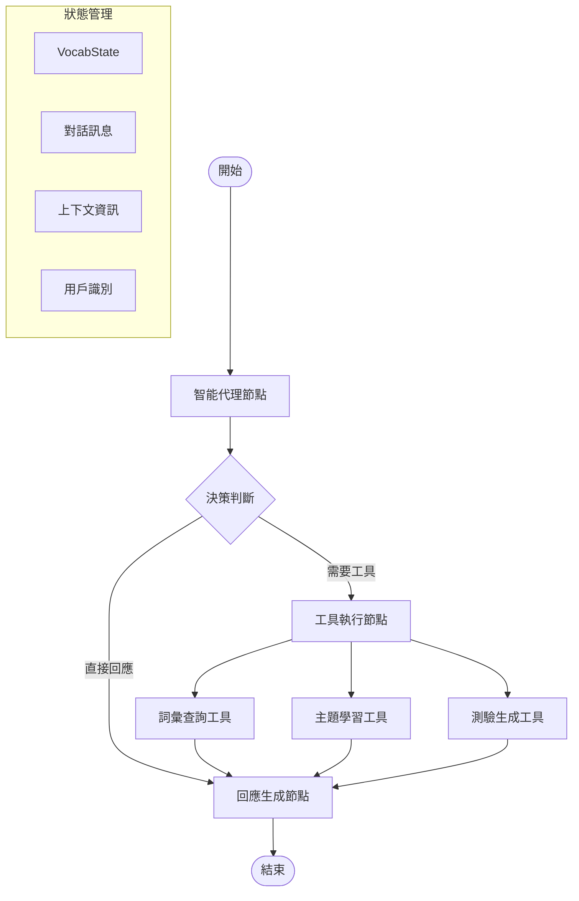
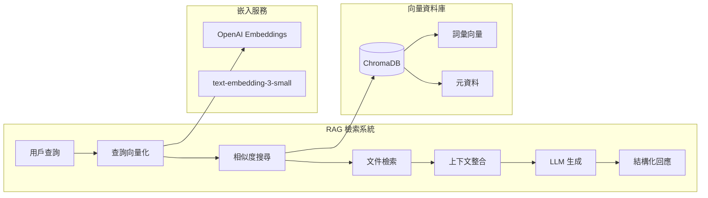
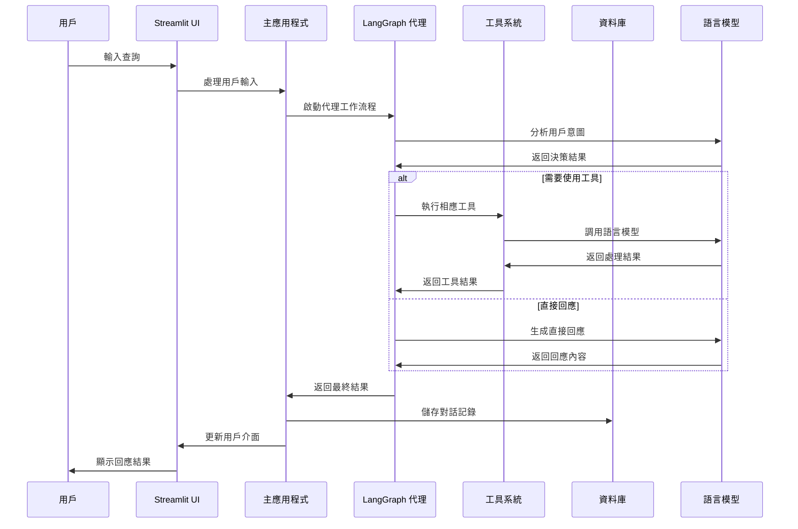
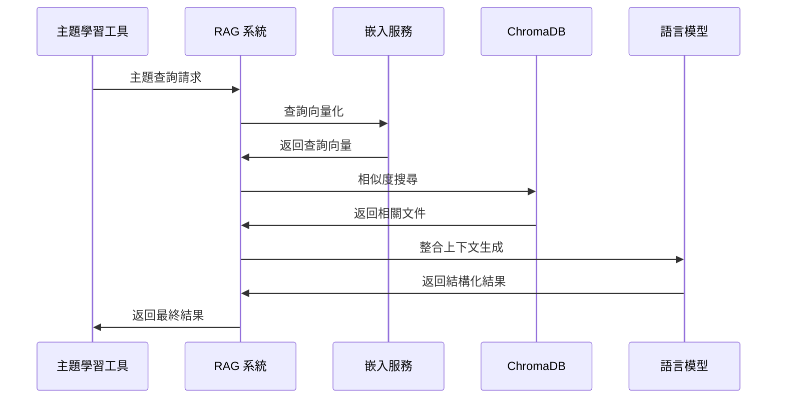
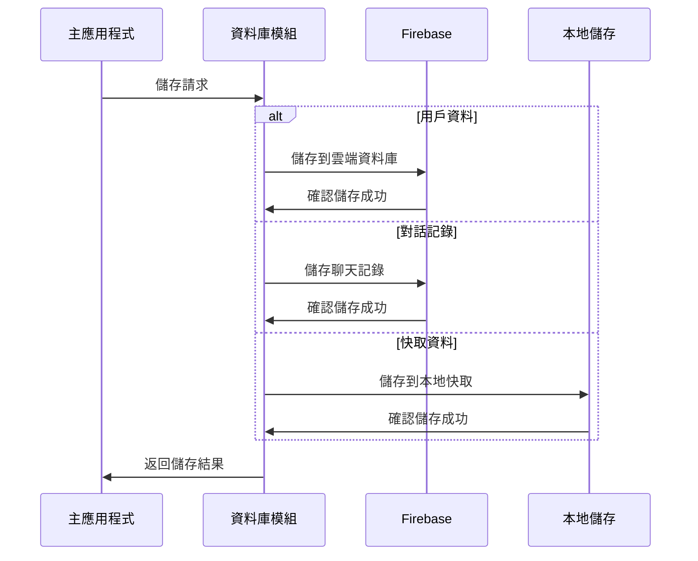

# VocabVoyage 架構說明文件

本文件詳細說明 VocabVoyage 英語詞彙學習平台的技術架構、設計理念和實作細節。

## 系統概覽

VocabVoyage 是一個基於現代 AI 技術的英語學習平台，採用微服務架構設計，整合了多種先進技術來提供智能化的學習體驗。

### 核心設計理念

- **AI 優先**：以人工智慧為核心，提供智能化的學習體驗
- **用戶中心**：所有功能設計都以提升用戶學習效果為目標
- **模組化架構**：採用鬆耦合的模組化設計，便於維護和擴展
- **雲端原生**：設計為雲端原生應用，支援水平擴展和高可用性
- **開源友善**：採用開源技術棧，便於社群貢獻和自主部署

## 整體架構

### 系統架構圖



### 技術棧概覽

| 層級 | 技術 | 用途 | 版本 |
|------|------|------|------|
| 前端 | Streamlit | Web UI 框架 | 1.28+ |
| 後端 | Python | 核心開發語言 | 3.11+ |
| AI 框架 | LangChain | LLM 應用開發 | 0.1+ |
| AI 框架 | LangGraph | 智能代理工作流程 | 0.0.40+ |
| 資料庫 | Firebase | 雲端即時資料庫 | - |
| 向量資料庫 | ChromaDB | 向量儲存和檢索 | 0.4+ |
| 本地資料庫 | SQLite | 本地資料儲存 | 3.0+ |
| 容器化 | Docker | 應用程式容器化 | 20.0+ |
| 套件管理 | Poetry | Python 依賴管理 | 1.7+ |

## 核心模組架構

### 1. 主應用程式模組 (src/app.py)

主應用程式模組是整個系統的入口點，負責協調各個子系統的運作。

```python
# 主要職責
class VocabVoyageApp:
    """VocabVoyage 主應用程式類別"""
    
    def __init__(self):
        """初始化應用程式組件"""
        self.config = load_config()
        self.database = VocabDatabase()
        self.agent_system = create_vocab_chain()
        
    def run(self):
        """啟動 Streamlit 應用程式"""
        # 設定頁面配置
        # 初始化會話狀態
        # 渲染用戶介面
        # 處理用戶互動
```

**核心功能：**
- 🎨 **UI 渲染**：管理 Streamlit 介面的渲染和更新
- 🔄 **狀態管理**：維護用戶會話狀態和對話歷史
- 🎯 **事件處理**：處理用戶輸入和系統回應
- 🔗 **模組整合**：協調各個子系統的協作

### 2. 智能代理模組 (src/agents.py)

智能代理模組是系統的核心 AI 組件，基於 LangGraph 框架實現複雜的決策邏輯。

#### LangGraph 工作流程架構



#### 狀態定義

```python
class VocabState(TypedDict):
    """定義 LangGraph 工作流程的狀態結構"""
    messages: Annotated[Sequence[BaseMessage], add_messages]
    context: dict  # 上下文資訊
    user_id: str   # 用戶識別碼
```

#### 核心節點實作

**1. 智能代理節點 (Agent Node)**
```python
def agent(state: VocabState):
    """
    智能代理節點：分析用戶意圖並決定處理策略
    
    職責：
    - 理解用戶輸入的語義和意圖
    - 決定是否需要使用工具
    - 選擇最適合的工具或直接生成回應
    """
    messages = state["messages"]
    
    # 系統提示詞定義代理行為
    system_message = """你是一個英語學習助手的路由器。
    你的任務是分析用戶問題並決定最佳的處理方式：
    - 單字查詢 → 使用 search_vocabulary_details 工具
    - 主題學習 → 使用 category_vocabulary_list 工具  
    - 測驗生成 → 使用 vocabulary_quiz_generator 工具
    - 一般對話 → 直接生成回應
    """
    
    # 使用 GPT 模型進行決策
    model = ChatOpenAI(temperature=0.7, model="gpt-4o-mini")
    model = model.bind_tools(tools)
    response = model.invoke([HumanMessage(content=system_message)] + messages)
    
    return {
        "messages": [response],
        "context": state["context"],
        "user_id": state["user_id"]
    }
```

**2. 工具執行節點 (Tool Node)**
```python
# 使用 LangGraph 內建的 ToolNode
tool_node = ToolNode(tools=tools)

# 工具會根據代理的決策自動執行相應的功能
```

**3. 回應生成節點 (Generate Node)**
```python
def generate_response(state: VocabState):
    """
    回應生成節點：生成最終的用戶回應
    
    職責：
    - 整合工具執行結果
    - 生成自然流暢的回應
    - 維護對話的連貫性
    """
    messages = state["messages"]
    
    # 檢查是否有工具執行結果
    last_message = messages[-1]
    if hasattr(last_message, 'tool_calls') and last_message.tool_calls:
        # 工具已執行，直接返回結果
        return {"messages": messages}
    
    # 生成直接回應
    model = ChatOpenAI(temperature=0.7, model="gpt-4o-mini")
    response = model.invoke(messages)
    
    return {"messages": [response]}
```

#### 條件邊邏輯

```python
def tools_condition(state: VocabState):
    """
    決定工作流程的下一步：執行工具或直接生成回應
    """
    messages = state["messages"]
    last_message = messages[-1]
    
    # 檢查代理是否決定使用工具
    if hasattr(last_message, 'tool_calls') and last_message.tool_calls:
        return "tools"
    else:
        return END
```

### 3. 工具系統架構

#### 工具定義和註冊

```python
from langchain.tools import Tool

tools = [
    Tool(
        name="search_vocabulary_details",
        description="""用於查詢單個英文單字或片語的詳細資訊""",
        func=search_vocabulary,
        return_direct=True
    ),
    Tool(
        name="category_vocabulary_list", 
        description="""用於獲取特定主題的相關英文單字列表""",
        func=get_category_vocabulary,
        return_direct=True
    ),
    Tool(
        name="vocabulary_quiz_generator",
        description="""用於生成特定主題的英文單字測驗""",
        func=generate_quiz,
        return_direct=True
    )
]
```

#### 工具實作細節

**1. 詞彙查詢工具**
```python
def search_vocabulary(query: str) -> str:
    """
    詞彙查詢工具實作
    
    流程：
    1. 接收用戶查詢的單字
    2. 使用 LLM 生成結構化的詞彙資訊
    3. 返回格式化的結果
    """
    # 使用專門的提示詞模板
    prompt_template = PromptTemplate(
        template=SYSTEM_PROMPTS["search"] + "\n\n查詢單字: {query}",
        input_variables=["query"]
    )
    
    # 建立處理鏈
    llm = ChatOpenAI(model="gpt-4o-mini", temperature=0.7)
    chain = prompt_template | llm | StrOutputParser()
    
    # 執行查詢並返回結果
    response = chain.invoke({"query": query})
    return response
```

**2. RAG 檢索工具**
```python
def get_category_vocabulary(category: str) -> str:
    """
    基於 RAG 的主題詞彙檢索工具
    
    流程：
    1. 設定向量資料庫檢索器
    2. 根據主題檢索相關文件
    3. 使用 LLM 處理檢索結果
    4. 生成結構化的詞彙列表
    """
    # 設定 RAG 檢索器
    retriever = setup_rag()
    
    # 檢索相關文件
    docs = retriever.invoke(category)
    context = "\n".join(doc.page_content for doc in docs)
    
    # 使用 LLM 處理檢索結果
    llm = ChatOpenAI(model="gpt-4o-mini", temperature=0.7)
    prompt = PromptTemplate(
        template=SYSTEM_PROMPTS["category"],
        input_variables=["context"]
    )
    chain = prompt | llm | StrOutputParser()
    
    response = chain.invoke({"context": context})
    return response
```

### 4. RAG 系統架構

#### RAG 系統組件



#### RAG 實作細節

```python
def setup_rag():
    """
    設定 RAG 檢索系統
    
    組件：
    - ChromaDB 向量資料庫
    - OpenAI 嵌入模型
    - 相似度檢索器
    """
    # 初始化向量資料庫
    vectorstore = Chroma(
        persist_directory="./data/chroma_db",
        embedding_function=OpenAIEmbeddings(
            model="text-embedding-3-small"
        ),
        collection_name="vocabulary_v1"
    )
    
    # 設定檢索器
    retriever = vectorstore.as_retriever(
        search_type="similarity",
        search_kwargs={"k": 1}  # 檢索最相關的 1 個文件
    )
    
    return retriever
```

#### 向量資料庫結構

```python
# 文件結構範例
{
    "page_content": "商業詞彙內容...",
    "metadata": {
        "category": "business",
        "source": "business_vocabulary.txt",
        "word_count": 150,
        "difficulty": "intermediate"
    }
}
```

### 資料庫架構設計

VocabVoyage 採用多資料庫架構，根據部署環境和用途自動選擇合適的資料庫：

| 環境類型 | 資料庫類型 | 檔案位置 | 用途 | 特點 |
|---------|-----------|----------|------|------|
| 本地開發 | SQLite | `data/vocab_learning.db` | 開發和測試 | 輕量級、無需配置、適合個人使用 |
| 生產環境 | Firebase Realtime DB | 雲端 | 正式部署 | 即時同步、多用戶支援、雲端備份 |
| 通用 | ChromaDB | `data/chroma_db/` | 向量檢索 | 語義搜尋、RAG 支援 |

#### 環境切換邏輯

系統根據 `ENV` 環境變數自動選擇資料庫類型：

```python
# 在 src/app.py 中的自動切換邏輯
if config.is_development():  # ENV=local/dev/development/loc
    from notebooks.models_sqlite import VocabDatabase  # SQLite 版本
else:  # ENV=prod/production
    from src.database import VocabDatabase  # Firebase 版本
```

**SQLite 模式特點**：
- ✅ 無需網路連線即可運行
- ✅ 零配置，自動初始化
- ✅ 適合開發和個人使用
- ✅ 資料儲存在本地檔案中
- ⚠️ 不支援多用戶同時存取

**Firebase 模式特點**：
- ✅ 支援多用戶即時同步
- ✅ 雲端備份和恢復
- ✅ 高可用性和擴展性
- ⚠️ 需要網路連線和 API 配置
- ⚠️ 可能產生使用費用

### 5. 資料庫架構

#### Firebase Realtime Database 結構

```json
{
  "users": {
    "user_id_1": {
      "username": "john_doe",
      "created_at": "2024-01-15T10:30:00Z",
      "preferences": {
        "language": "zh-TW",
        "difficulty": "intermediate"
      }
    }
  },
  "vocabulary": {
    "user_id_1": {
      "vocab_id_1": {
        "word": "innovation",
        "definition": "創新；革新",
        "examples": [
          "The company's innovation...",
          "Her innovation in teaching..."
        ],
        "notes": "常用於商業語境",
        "created_at": "2024-01-15T11:00:00Z"
      }
    }
  },
  "chat_sessions": {
    "user_id_1": {
      "session_id_1": {
        "name": "商業英文學習",
        "created_at": "2024-01-15T09:00:00Z",
        "messages": {
          "message_id_1": {
            "role": "user",
            "content": "查詢單字 innovation",
            "timestamp": "2024-01-15T09:05:00Z"
          },
          "message_id_2": {
            "role": "assistant", 
            "content": "單字：innovation...",
            "timestamp": "2024-01-15T09:05:30Z"
          }
        }
      }
    }
  }
}
```

#### 資料庫操作模組

```python
class VocabDatabase:
    """Firebase 資料庫操作類別"""
    
    def __init__(self):
        """初始化 Firebase 連接"""
        self.db = self._initialize_firebase()
    
    def _initialize_firebase(self):
        """初始化 Firebase 服務"""
        # 載入服務帳戶金鑰
        # 初始化 Firebase Admin SDK
        # 返回資料庫參考
    
    def get_or_create_user(self, username: str) -> str:
        """獲取或創建用戶帳戶"""
        # 檢查用戶是否存在
        # 如不存在則創建新用戶
        # 返回用戶 ID
    
    def add_vocabulary(self, user_id: str, word: str, 
                      definition: str, examples: List[str], 
                      notes: str = "") -> bool:
        """添加單字到用戶詞彙本"""
        # 檢查單字是否已存在
        # 創建新的詞彙記錄
        # 儲存到 Firebase
    
    def get_user_vocabulary(self, user_id: str) -> List[dict]:
        """獲取用戶的詞彙列表"""
        # 從 Firebase 檢索用戶詞彙
        # 格式化並返回結果
```

### 6. 配置管理架構

#### 配置模組設計

```python
# src/config.py
class Config:
    """應用程式配置管理類別"""
    
    def __init__(self):
        """載入配置設定"""
        self.openai_api_key = self._get_env_var("OPENAI_API_KEY")
        self.firebase_config = self._load_firebase_config()
        self.streamlit_config = self._load_streamlit_config()
    
    def _get_env_var(self, key: str, default: str = None) -> str:
        """安全地獲取環境變數"""
        value = os.getenv(key, default)
        if not value:
            raise ConfigurationError(f"必要的環境變數 {key} 未設定")
        return value
    
    def _load_firebase_config(self) -> dict:
        """載入 Firebase 配置"""
        # 載入服務帳戶金鑰檔案
        # 驗證配置完整性
        # 返回配置字典
    
    def validate_config(self) -> bool:
        """驗證配置完整性"""
        # 檢查所有必要的配置項目
        # 測試外部服務連接
        # 返回驗證結果
```

#### 環境變數管理

```bash
# .env 檔案結構
# OpenAI 設定
OPENAI_API_KEY=sk-your-api-key-here
OPENAI_MODEL=gpt-4o-mini
OPENAI_TEMPERATURE=0.7

# Firebase 設定
GOOGLE_APPLICATION_CREDENTIALS=./FirebaseKey.json
FIREBASE_DATABASE_URL=https://your-project.firebaseio.com/

# Streamlit 設定
STREAMLIT_SERVER_PORT=8501
STREAMLIT_SERVER_ADDRESS=0.0.0.0
STREAMLIT_THEME_PRIMARY_COLOR=#FF6B6B

# ChromaDB 設定
CHROMA_DB_PATH=./data/chroma_db
CHROMA_COLLECTION_NAME=vocabulary_v1

# 日誌設定
LOG_LEVEL=INFO
LOG_FILE=vocabvoyage.log
```

## 資料流程架構

### 1. 用戶互動流程



### 2. RAG 檢索流程



### 3. 資料儲存流程



## 安全架構

### 1. API 金鑰管理

```python
class SecureConfig:
    """安全配置管理"""
    
    def __init__(self):
        """初始化安全配置"""
        self._api_keys = {}
        self._load_encrypted_keys()
    
    def _load_encrypted_keys(self):
        """載入加密的 API 金鑰"""
        # 從環境變數載入金鑰
        # 驗證金鑰格式和有效性
        # 實作金鑰輪換機制
    
    def get_api_key(self, service: str) -> str:
        """安全地獲取 API 金鑰"""
        # 檢查金鑰是否存在
        # 記錄金鑰使用情況
        # 返回解密後的金鑰
```

### 2. 資料加密

```python
class DataEncryption:
    """資料加密服務"""
    
    def encrypt_user_data(self, data: dict) -> dict:
        """加密用戶敏感資料"""
        # 識別敏感欄位
        # 使用 AES 加密
        # 返回加密後的資料
    
    def decrypt_user_data(self, encrypted_data: dict) -> dict:
        """解密用戶資料"""
        # 驗證資料完整性
        # 解密敏感欄位
        # 返回原始資料
```

### 3. 存取控制

```python
class AccessControl:
    """存取控制管理"""
    
    def authenticate_user(self, user_id: str) -> bool:
        """用戶身份驗證"""
        # 驗證用戶身份
        # 檢查帳戶狀態
        # 記錄登入事件
    
    def authorize_action(self, user_id: str, action: str) -> bool:
        """操作授權檢查"""
        # 檢查用戶權限
        # 驗證操作合法性
        # 記錄授權事件
```

## 效能優化架構

### 1. 快取策略

```python
class CacheManager:
    """快取管理系統"""
    
    def __init__(self):
        """初始化快取系統"""
        self.memory_cache = {}
        self.redis_cache = None  # 可選的 Redis 快取
    
    def get_cached_response(self, query_hash: str) -> Optional[str]:
        """獲取快取的回應"""
        # 檢查記憶體快取
        # 檢查持久化快取
        # 返回快取結果或 None
    
    def cache_response(self, query_hash: str, response: str, ttl: int = 3600):
        """快取回應結果"""
        # 儲存到記憶體快取
        # 儲存到持久化快取
        # 設定過期時間
```

### 2. 連接池管理

```python
class ConnectionPool:
    """資料庫連接池管理"""
    
    def __init__(self, max_connections: int = 10):
        """初始化連接池"""
        self.max_connections = max_connections
        self.active_connections = []
        self.idle_connections = []
    
    def get_connection(self):
        """獲取資料庫連接"""
        # 檢查空閒連接
        # 創建新連接（如需要）
        # 返回可用連接
    
    def release_connection(self, connection):
        """釋放資料庫連接"""
        # 清理連接狀態
        # 返回到空閒池
        # 管理連接生命週期
```

### 3. 非同步處理

```python
import asyncio
from concurrent.futures import ThreadPoolExecutor

class AsyncProcessor:
    """非同步處理器"""
    
    def __init__(self):
        """初始化非同步處理器"""
        self.executor = ThreadPoolExecutor(max_workers=4)
    
    async def process_multiple_queries(self, queries: List[str]) -> List[str]:
        """並行處理多個查詢"""
        # 創建非同步任務
        # 並行執行查詢
        # 收集並返回結果
        
        tasks = [
            asyncio.create_task(self.process_single_query(query))
            for query in queries
        ]
        
        results = await asyncio.gather(*tasks)
        return results
```

## 監控和日誌架構

### 1. 日誌系統

```python
import logging
from datetime import datetime

class VocabLogger:
    """VocabVoyage 日誌系統"""
    
    def __init__(self):
        """初始化日誌系統"""
        self.logger = self._setup_logger()
    
    def _setup_logger(self):
        """設定日誌配置"""
        logger = logging.getLogger('vocabvoyage')
        logger.setLevel(logging.INFO)
        
        # 檔案處理器
        file_handler = logging.FileHandler('vocabvoyage.log')
        file_handler.setLevel(logging.INFO)
        
        # 控制台處理器
        console_handler = logging.StreamHandler()
        console_handler.setLevel(logging.DEBUG)
        
        # 格式化器
        formatter = logging.Formatter(
            '%(asctime)s - %(name)s - %(levelname)s - %(message)s'
        )
        file_handler.setFormatter(formatter)
        console_handler.setFormatter(formatter)
        
        logger.addHandler(file_handler)
        logger.addHandler(console_handler)
        
        return logger
    
    def log_user_action(self, user_id: str, action: str, details: dict = None):
        """記錄用戶操作"""
        log_data = {
            'user_id': user_id,
            'action': action,
            'timestamp': datetime.now().isoformat(),
            'details': details or {}
        }
        self.logger.info(f"User Action: {log_data}")
    
    def log_api_call(self, service: str, endpoint: str, response_time: float):
        """記錄 API 呼叫"""
        log_data = {
            'service': service,
            'endpoint': endpoint,
            'response_time': response_time,
            'timestamp': datetime.now().isoformat()
        }
        self.logger.info(f"API Call: {log_data}")
```

### 2. 效能監控

```python
import time
from functools import wraps

def monitor_performance(func):
    """效能監控裝飾器"""
    @wraps(func)
    def wrapper(*args, **kwargs):
        start_time = time.time()
        
        try:
            result = func(*args, **kwargs)
            execution_time = time.time() - start_time
            
            # 記錄成功執行
            logger.info(f"{func.__name__} executed in {execution_time:.2f}s")
            
            return result
            
        except Exception as e:
            execution_time = time.time() - start_time
            
            # 記錄執行錯誤
            logger.error(f"{func.__name__} failed after {execution_time:.2f}s: {str(e)}")
            
            raise
    
    return wrapper

# 使用範例
@monitor_performance
def search_vocabulary(query: str) -> str:
    # 詞彙查詢邏輯
    pass
```

### 3. 健康檢查

```python
class HealthChecker:
    """系統健康檢查"""
    
    def __init__(self):
        """初始化健康檢查器"""
        self.checks = {
            'database': self._check_database,
            'openai_api': self._check_openai_api,
            'chroma_db': self._check_chroma_db
        }
    
    def _check_database(self) -> bool:
        """檢查 Firebase 資料庫連接"""
        try:
            # 測試資料庫連接
            # 執行簡單查詢
            return True
        except Exception:
            return False
    
    def _check_openai_api(self) -> bool:
        """檢查 OpenAI API 可用性"""
        try:
            # 測試 API 連接
            # 執行簡單請求
            return True
        except Exception:
            return False
    
    def _check_chroma_db(self) -> bool:
        """檢查 ChromaDB 可用性"""
        try:
            # 測試向量資料庫連接
            # 執行簡單查詢
            return True
        except Exception:
            return False
    
    def run_health_check(self) -> dict:
        """執行完整健康檢查"""
        results = {}
        
        for service, check_func in self.checks.items():
            try:
                results[service] = {
                    'status': 'healthy' if check_func() else 'unhealthy',
                    'timestamp': datetime.now().isoformat()
                }
            except Exception as e:
                results[service] = {
                    'status': 'error',
                    'error': str(e),
                    'timestamp': datetime.now().isoformat()
                }
        
        return results
```

## 部署架構

### 1. Docker 容器化

```dockerfile
# 多階段建置 Dockerfile
FROM python:3.11-slim as builder

# 安裝 Poetry
RUN pip install poetry==1.7.1

# 設定工作目錄
WORKDIR /app

# 複製依賴檔案
COPY pyproject.toml poetry.lock* ./

# 安裝依賴
RUN poetry config virtualenvs.create false \
    && poetry install --no-dev --no-interaction --no-ansi

# 生產階段
FROM python:3.11-slim as production

# 複製已安裝的套件
COPY --from=builder /usr/local/lib/python3.11/site-packages /usr/local/lib/python3.11/site-packages
COPY --from=builder /usr/local/bin /usr/local/bin

# 設定工作目錄
WORKDIR /app

# 複製應用程式檔案
COPY . .

# 建立非 root 用戶
RUN useradd --create-home --shell /bin/bash app \
    && chown -R app:app /app
USER app

# 設定環境變數
ENV PYTHONPATH=/app
ENV PORT=8501

# 健康檢查
HEALTHCHECK --interval=30s --timeout=10s --start-period=5s --retries=3 \
    CMD curl -f http://localhost:$PORT/_stcore/health || exit 1

# 啟動命令
CMD streamlit run src/app.py --server.port $PORT --server.address 0.0.0.0
```

### 2. Docker Compose 配置

```yaml
version: '3.8'

services:
  vocabvoyage:
    build: .
    ports:
      - "8501:8501"
    environment:
      - OPENAI_API_KEY=${OPENAI_API_KEY}
      - FIREBASE_DATABASE_URL=${FIREBASE_DATABASE_URL}
    volumes:
      - ./FirebaseKey.json:/app/FirebaseKey.json:ro
      - ./data:/app/data
      - ./logs:/app/logs
    restart: unless-stopped
    healthcheck:
      test: ["CMD", "curl", "-f", "http://localhost:8501/_stcore/health"]
      interval: 30s
      timeout: 10s
      retries: 3
      start_period: 40s
    
  # 可選：Redis 快取服務
  redis:
    image: redis:7-alpine
    ports:
      - "6379:6379"
    volumes:
      - redis_data:/data
    restart: unless-stopped
    
  # 可選：監控服務
  prometheus:
    image: prom/prometheus
    ports:
      - "9090:9090"
    volumes:
      - ./monitoring/prometheus.yml:/etc/prometheus/prometheus.yml
    restart: unless-stopped

volumes:
  redis_data:
```

### 3. Kubernetes 部署

```yaml
# deployment.yaml
apiVersion: apps/v1
kind: Deployment
metadata:
  name: vocabvoyage
  labels:
    app: vocabvoyage
spec:
  replicas: 3
  selector:
    matchLabels:
      app: vocabvoyage
  template:
    metadata:
      labels:
        app: vocabvoyage
    spec:
      containers:
      - name: vocabvoyage
        image: vocabvoyage:latest
        ports:
        - containerPort: 8501
        env:
        - name: OPENAI_API_KEY
          valueFrom:
            secretKeyRef:
              name: api-keys
              key: openai-api-key
        - name: FIREBASE_DATABASE_URL
          valueFrom:
            configMapKeyRef:
              name: app-config
              key: firebase-url
        resources:
          requests:
            memory: "512Mi"
            cpu: "250m"
          limits:
            memory: "1Gi"
            cpu: "500m"
        livenessProbe:
          httpGet:
            path: /_stcore/health
            port: 8501
          initialDelaySeconds: 30
          periodSeconds: 10
        readinessProbe:
          httpGet:
            path: /_stcore/health
            port: 8501
          initialDelaySeconds: 5
          periodSeconds: 5

---
# service.yaml
apiVersion: v1
kind: Service
metadata:
  name: vocabvoyage-service
spec:
  selector:
    app: vocabvoyage
  ports:
    - protocol: TCP
      port: 80
      targetPort: 8501
  type: LoadBalancer
```

## 擴展性架構

### 1. 水平擴展策略

```python
class LoadBalancer:
    """負載均衡器"""
    
    def __init__(self):
        """初始化負載均衡器"""
        self.instances = []
        self.current_index = 0
    
    def add_instance(self, instance_url: str):
        """添加服務實例"""
        self.instances.append(instance_url)
    
    def get_next_instance(self) -> str:
        """獲取下一個可用實例（輪詢策略）"""
        if not self.instances:
            raise Exception("沒有可用的服務實例")
        
        instance = self.instances[self.current_index]
        self.current_index = (self.current_index + 1) % len(self.instances)
        
        return instance
```

### 2. 微服務架構

```python
# 詞彙服務
class VocabularyService:
    """詞彙管理微服務"""
    
    def __init__(self):
        self.database = VocabDatabase()
    
    def search_word(self, word: str) -> dict:
        """詞彙查詢服務"""
        pass
    
    def add_word(self, user_id: str, word_data: dict) -> bool:
        """添加詞彙服務"""
        pass

# AI 服務
class AIService:
    """AI 處理微服務"""
    
    def __init__(self):
        self.llm_client = OpenAI()
    
    def generate_response(self, prompt: str) -> str:
        """生成 AI 回應"""
        pass
    
    def generate_quiz(self, topic: str) -> dict:
        """生成測驗"""
        pass

# 用戶服務
class UserService:
    """用戶管理微服務"""
    
    def __init__(self):
        self.database = UserDatabase()
    
    def authenticate_user(self, credentials: dict) -> bool:
        """用戶認證"""
        pass
    
    def get_user_profile(self, user_id: str) -> dict:
        """獲取用戶資料"""
        pass
```

### 3. API Gateway

```python
from flask import Flask, request, jsonify
import requests

class APIGateway:
    """API 閘道器"""
    
    def __init__(self):
        self.app = Flask(__name__)
        self.services = {
            'vocabulary': 'http://vocabulary-service:8001',
            'ai': 'http://ai-service:8002',
            'user': 'http://user-service:8003'
        }
        self._setup_routes()
    
    def _setup_routes(self):
        """設定路由"""
        
        @self.app.route('/api/vocabulary/<path:path>', methods=['GET', 'POST'])
        def vocabulary_proxy(path):
            return self._proxy_request('vocabulary', path)
        
        @self.app.route('/api/ai/<path:path>', methods=['GET', 'POST'])
        def ai_proxy(path):
            return self._proxy_request('ai', path)
        
        @self.app.route('/api/user/<path:path>', methods=['GET', 'POST'])
        def user_proxy(path):
            return self._proxy_request('user', path)
    
    def _proxy_request(self, service: str, path: str):
        """代理請求到對應的微服務"""
        service_url = self.services.get(service)
        if not service_url:
            return jsonify({'error': 'Service not found'}), 404
        
        # 轉發請求
        response = requests.request(
            method=request.method,
            url=f"{service_url}/{path}",
            headers=dict(request.headers),
            data=request.get_data(),
            params=request.args
        )
        
        return response.content, response.status_code, response.headers.items()
```

## 總結

VocabVoyage 的架構設計體現了現代 AI 應用的最佳實踐：

### 核心優勢

1. **模組化設計**：各組件職責清晰，便於維護和擴展
2. **AI 驅動**：充分利用 LangGraph 和 RAG 技術提供智能體驗
3. **雲端原生**：支援容器化部署和水平擴展
4. **安全可靠**：完整的安全機制和監控系統
5. **用戶友善**：直觀的介面和流暢的互動體驗

### 技術創新

- **LangGraph 工作流程**：實現複雜的 AI 決策邏輯
- **RAG 檢索系統**：結合向量搜尋和生成式 AI
- **多模型整合**：靈活運用不同的 AI 模型
- **即時資料同步**：Firebase 提供的雲端同步能力

### 未來發展

這個架構為未來的功能擴展奠定了堅實基礎，支援：
- 多語言學習擴展
- 語音互動功能
- 社交學習特性
- 個人化推薦系統
- 大規模用戶支援

通過這個全面的架構設計，VocabVoyage 不僅能夠提供優秀的英語學習體驗，也為 AI 教育應用的發展提供了有價值的參考。